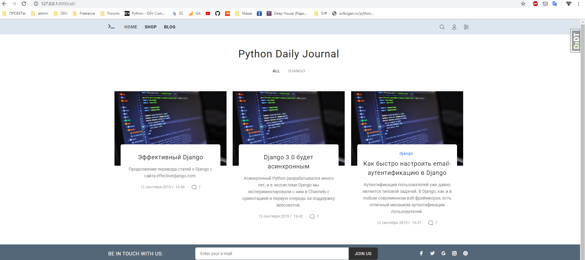
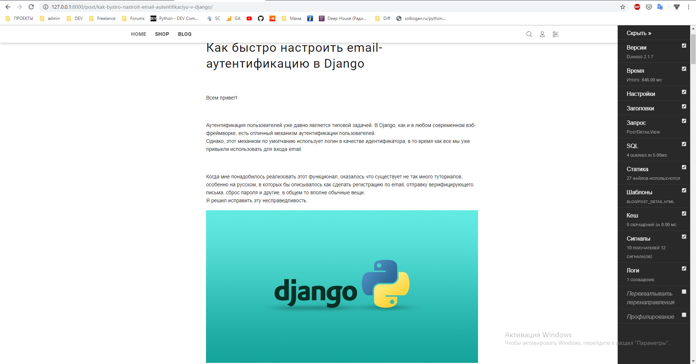
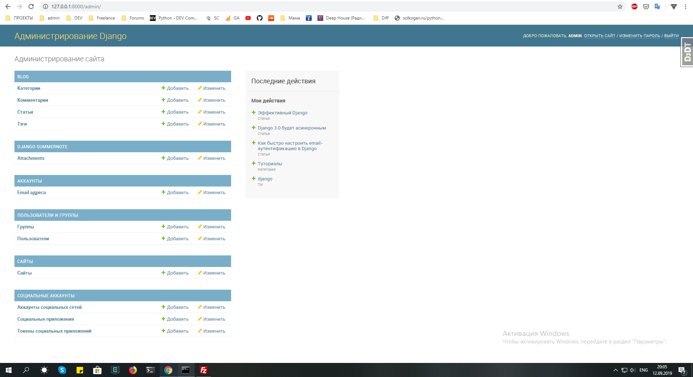
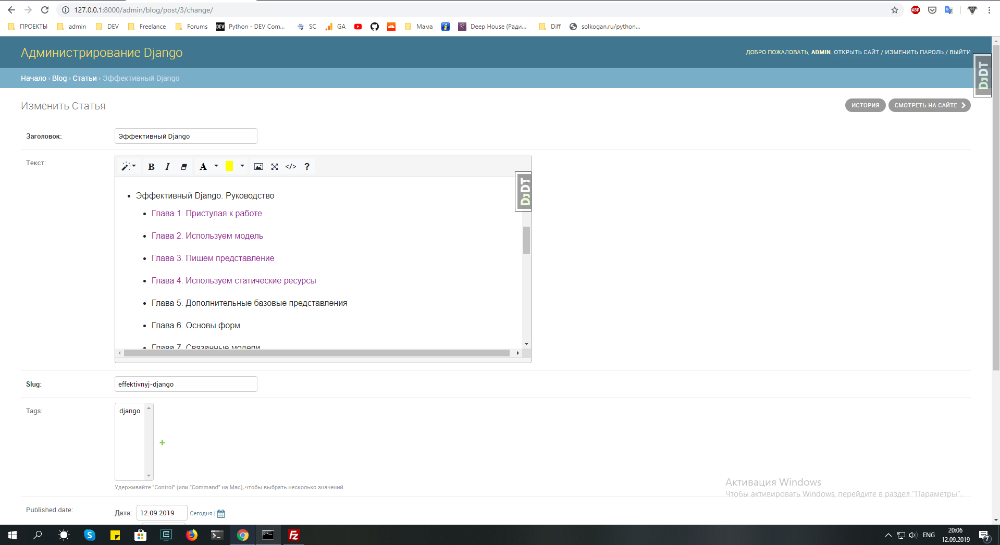

# django_blog
Website building with Django framework

## Initial Setup

- $ cd path/to/your/dev/folder
- $ git clone git@github.com:artem090587/django_blog.git
- $ cd django_blog
- $ virtualenv -p python3 venv
- $ source bin/activate
- $ pip install -r requirements.txt

